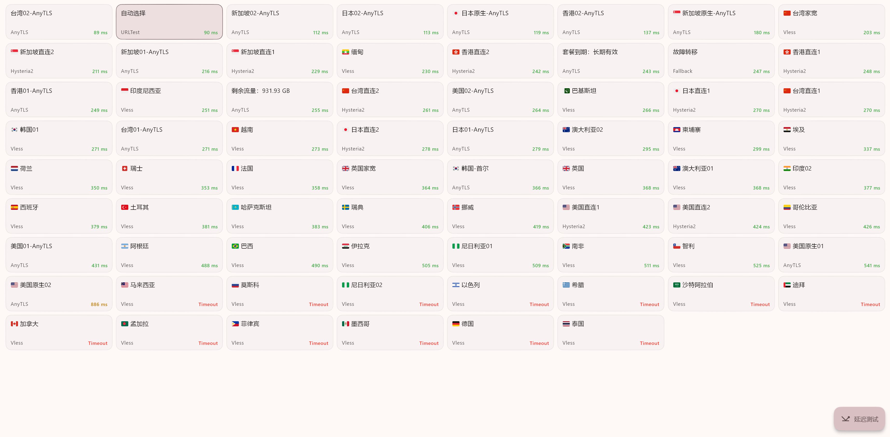
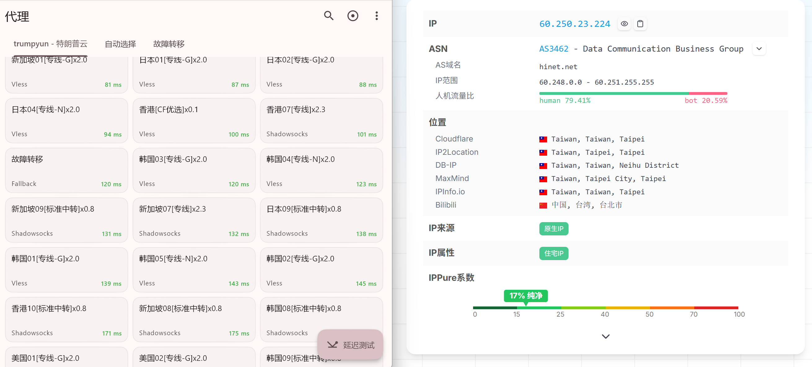
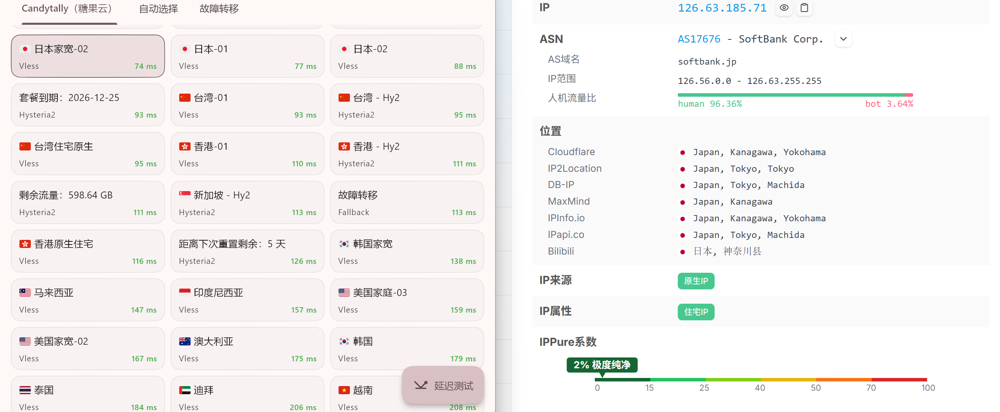
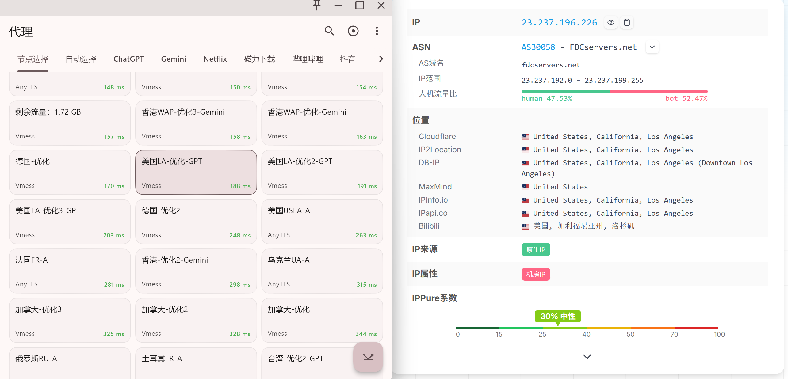

# 机场梯子推荐：2026 稳定机场、Clash 节点实测与优惠码

想找一个长期可用的**机场梯子**，不能只比较价格和节点数量。晚高峰是否拥堵、常用节点能否持续连接、客户端是否兼容，以及服务商发生故障时有没有备用，才是影响实际体验的关键。

本文保留我正在使用和持续观察的机场名单，按照“主力机场梯子”和“备用机场梯子”分类，汇总线路、协议、套餐价格、适用场景、缺点及优惠码。如果你正在搜索“机场梯子推荐”“Clash 机场推荐”“稳定机场节点”或“便宜梯子”，可以先看结论，再根据自己的运营商和预算选择。

> 1. **测试基础**：文中机场均有付费使用或持续观察记录，重点查看晚高峰连接、常用节点、流媒体与日常办公体验。  
> 2. **如实写缺点**：线路、设备限制、客户端限制和已知问题均尽量保留，不以官网宣传代替实际体验。  
> 3. **购买策略**：主力与备用应来自不同服务商，避免单一入口、维护或停止运营导致完全断网。  
> 4. **信息时效**：套餐、优惠码和节点会变化，请以下单页面和服务商公告为准。
> 5. **最后更新**：2026-07-24。欢迎 Star 收藏，[TG 频道](https://t.me/best_jichang)。

---

## 2026 机场梯子近期情况

> 目前不建议把所有需求押在一家机场上。综合使用可以先看[红杏云](#hongxingyun)，更重视晚高峰可以测试[特朗普云](#trumpyun)和[快雷 GO](#kuaileigo)。这些结论来自当前测试记录，不代表所有地区和运营商都会得到相同结果。

---

## 机场梯子怎么选？先看晚高峰、线路匹配与备用能力

选择机场梯子不能只看节点数量、套餐流量和标称速率。真正影响使用体验的，是晚高峰是否稳定、线路是否适合自己的运营商、常用节点能否持续连接，以及服务出现故障后有没有备用方案。

没有一家机场能够保证永久稳定。更现实的选择方法，是先判断自己最在意的使用场景，再通过短周期套餐进行实际测试。

### 机场梯子晚高峰为什么容易卡？

晚高峰变慢通常不是单一原因，常见影响因素包括：

- 同一入口或出口线路同时使用的人数增加；
- 机场购买的带宽不足；
- 中转入口、落地服务器或跨境路由拥堵；
- 节点负载过高；
- 本地电信、联通或移动的路由质量发生变化。

因此，套餐标注的 500Mbps 或 1000Mbps 只能代表理论上限，不能直接说明晚高峰表现。

> **怎么测试**：先购买月付或最低档套餐，在工作日 20:00—23:00 测试常用的香港、日本、新加坡和美国节点。除了测速，还要观察视频播放、网页响应、丢包和持续连接情况。

IEPL/IPLC 专线通常比普通直连更容易获得稳定的路由，但“专线”不代表带宽完全独享，也不能保证永不拥堵或维护。购买前仍然需要实际测试。

### 机场节点全红、Clash 连不上是什么原因？

节点全部无法连接，不一定代表机场已经停止运营，也不能直接判断为入口 IP 出现问题。常见原因包括：

1. 本地宽带或 Wi-Fi 异常；
2. 订阅到期、流量用完或订阅链接失效；
3. Clash、Mihomo 等客户端版本过旧；
4. DNS、系统时间或配置文件错误；
5. 机场入口、落地服务器或域名出现故障；
6. 服务商正在维护或更换线路。

遇到问题时，可以先切换手机热点、更新订阅、检查套餐状态，再尝试其他协议和地区节点。如果所有设备和网络都无法连接，再查看服务商公告或提交工单。

> **怎么降低影响**：主力和备用尽量选择不同服务商、不同线路结构，并保留一个不限时流量包。这样不能彻底消除故障，但可以降低单点中断带来的影响。

### 怎么判断一家机场梯子是否值得长期购买？

无法仅凭官网参数判断一家机场能否长期运营，但可以观察以下风险信号：

- 长期只宣传折扣，很少发布维护和故障公告；
- 套餐没有明确说明流量、速率、设备限制和退款规则；
- 客服或工单长期无人处理；
- 短期内频繁更换官网、订阅域名或收款方式；
- 只允许多年付款，没有月付或低成本试用；
- 用户反馈高度一致，缺少能够核实的具体使用细节。

运营时间、用户讨论和维护记录可以作为参考，但都不能单独证明服务商一定可靠。

> **购买建议**：新机场先购买一个月，在自己的运营商和常用设备上观察 1—3 个月。确认晚高峰、客服和节点表现符合需求后，再考虑季付或半年付，不建议因为折扣直接购买多年套餐。

### 直连、中转和专线机场怎么选？

| 线路类型 | 一般特点 | 主要风险 | 适合场景 |
|---|---|---|---|
| 境外直连 | 价格较低，线路结构简单 | 容易受跨境路由和本地运营商影响 | 轻度使用、低价备用 |
| 公网中转 | 国内连接通常更友好 | 入口和共享带宽可能在晚高峰拥堵 | 预算有限的日常用户 |
| IEPL/IPLC 专线 | 路由通常更稳定，延迟波动相对较小 | 价格较高，仍可能共享容量或进行维护 | 远程办公、重度视频和稳定性需求 |

特殊地区或网络环境不能直接套用通用结论，应优先选择支持短周期测试、能够提供当地使用记录的机场。

**我的搭配方式**是一个主力机场加一个不同服务商的备用。如果日常工作严重依赖网络，再准备一个不限时流量包。备用的意义不是追求同样快，而是在主力维护或线路异常时仍然能够连接。

---

## 机场梯子推荐目录

- [一、稳定机场梯子（主力推荐）](#main)
  - [1. 红杏云](#hongxingyun)
  - [2. 特朗普云](#trumpyun)
  - [3. 快雷go](#kuaileigo)
  - [4. 糖果云](#tangguo)
  - [5. 万达云](#wandayun)
  - [6. 悦通](#yuetong)
- [二、便宜机场梯子与备用节点](#backup)
  - [1. Mitce](#mitce)
  - [2. SSRDOG](#ssrdog)
  - [3. 乌龟加速](#wuguijiasu)
  - [4. 飞鸟云](#feiniaoyun)
  - [5. M78星云](#m78)
  - [6. 宝可梦加速器](#baokemeng)
  - [7. 渔云Cloufisher](#yuyun)
  - [8. 魔戒](#mojie)
- [三、机场梯子优惠码汇总](#unlimited)
- [四、机场梯子选择策略](#choose)
- [机场梯子 FAQ](#faq)
- [更新纪录](#update)

---

## 一、稳定机场梯子推荐：适合作为主力

> **购买建议**：对网络依赖较高时，最好准备两个来自不同服务商的主力或“一个主力 + 一个备用”。单一机场可能遇到入口故障、服务器维护或节点调整，备用服务可以降低中断影响。

---

### 1. 红杏云 - 直连 + 家宽 + 原生 综合体验最强

**官网入口**：
- [红杏云官网](https://go.clashshome.com/hongxingyun)，[备用地址](https://hongxing24.cc/web/#/login?code=bUIxQadH)

**优惠码**：`ABING888`（全场 8 折，一个账户可用两次）

**机场档案**
| 项目 | 详情 |
|------|------|
| 开业时间 | 2023 年 |
| 老板肉身 | 境外 |
| 入口与过境 | 香港 |
| 节点地区 | 香港、台湾、日本、新加坡、美国、韩国、英国、德国等 |
| 落地 ISP | Sakura Link Limited、Amazon.com（AWS） |
| 节点数量 | 50+ |
| 协议 | Vless + AnyTLS |
| 设备限制 | 不限制（合理使用） |
| AI流媒体解锁 | AI全解锁 · Netflix / Disney+ / YouTube Premium |
| 审计情况 | 无审计 |
| 付款方式 | 支付宝 / 微信 / USDT |
| TG 频道 | [点击加入](https://t.me/Hongxingyun_bot) |
| 一键客户端 | Windows / Mac / Android / iOS / 软路由 |

**核心优势**：
- ✅ 专线 + 多地家宽、原生IP，晚高峰稳定，客服工单回复速度快
- ✅ 50+节点，94% 可用率，实测平均延迟仅 52ms
- ✅ 完美解锁 Netflix/Disney+/ChatGPT，附赠 EMBY 影视库
- ✅ 不限设备，全家共享无压力

**缺点**：
- 官方Windows的一键客户端放弃了原来的客户端，现在强制改的Clash verge的，估计有的人不会喜欢。但是好在订阅还是开放的，可以不用。

**我的使用体验**：从 2024 年底开始用，轻量套餐每天刷剧+办公完全够用。是一家价格实惠、生态完善的近乎全能的机场，适合大部分场景使用。

**推荐套餐**：

| 套餐名称 | 价格 | 流量 | 速率 | 备注 |
|---------|------|------|------|------|
| 轻量-包月 200G | ¥20/月 | 200GB | 300Mbps | 入门首选，支持季付/年付优惠 |
| 冲浪-包月 500G | ¥40/月 | 500GB | 500Mbps | 性价比最高，我主力使用 |
| 豪华-包月 800G | ¥60/月 | 800GB | 800Mbps | 重度用户 |
| 大师-包月 1200G | ¥80/月 | 1200GB | 1000Mbps | 高强度使用 |
| 高级-不限时 3000G | ¥388/一次性 | 1000Mbps | 永久有效 |  |
| 豪华-不限时 6000G | ¥688/一次性 | 1000Mbps | 最多 20 台设备 |  |

[点击查看红杏云测速](https://jichangtizi.com/zhulijichang/hongxingyun-review/)

  

---

### 2. 特朗普云 Trumpyun - 中转 + 专线 + 住宅 高性价比

**官网入口**：
- [特朗普云官网](https://go.clashshome.com/trumpyun)，[备用地址](  https://trumpyun.xyz/#/register?code=ZnngCcmM)

**机场档案**
| 项目 | 详情 |
|------|------|
| 开业时间 | 2025 年 |
| 老板肉身 | 境外 |
| 入口与过境 | 香港 |
| 节点地区 | 香港、台湾、美国、新加坡、日本、马来西亚、印尼等 |
| 落地 ISP | GoMami Networks、Sakura Link Limited、PAN-LIAN TECHNOLOGY CO., LIMITED |
| 节点数量 | 70+ |
| 协议 | SS × 38 / VLESS × 35 |
| 线路类型 | 专线 + 中转 |
| 设备限制 | 不限制 |
| AI流媒体解锁 | 支持全球流媒体与 AI 工具 |
| 审计情况 | 严格无日志政策 |
| 付款方式 | 支付宝 / 微信 / USDT-TRC20 / USDT-Polygon |
| TG 群组 | [点击加入](https://t.me/trumpyun2025) |
| 一键客户端 | 不支持 |

**核心优势**：
- ✅ 包含中转与 IEPL 高速专线，晚高峰速度快
- ✅ AI与流媒体解锁能力一流
- ✅ 最高 1Gbps 速率，高峰不限速
- ✅ 严格无日志政策，保护访问记录
- ✅ 流量用尽可随时重置或叠加包
- ✅ 工单系统与 TG 群组全天支持

**缺点**：
- 2025 年新开机场，运营时间较短
- 不支持一键客户端，仅支持订阅

**我的使用体验**：近期严打下晚高峰速度依然很快，性价比极高，适合追求高速且预算有限的用户。

**推荐套餐**：

| 套餐名称 | 价格 | 流量 | 速率 | 备注 |
|---------|------|------|------|------|
| 110G 轻享版 | ¥15/月 | 110GB | 1Gbps | 入门首选，性价比极高 |
| 200G 极速版 | ¥26/月 | 200GB | 1Gbps | 日常主力推荐 |
| 300G 尊享版 | ¥38/月 | 300GB | 1Gbps | 重度用户首选 |
| 500G 旗舰版 | ¥55/月 | 500GB | 1Gbps | 顶级额度，视频下载无忧 |

[点击查看特朗普云测速](https://jichangtizi.com/zhulijichang/trumpyun-review/)

  

---

### 3. 快雷go - IEPL专线 + 全流媒体解锁 + 电信方向优化

**官网入口**：
- [快雷go官网](https://go.clashshome.com/kuaileigo)，[备用地址](https://www.kuailei.vip/register?code=n5YVQYr2)

**优惠码**：`kuailei888`

**机场档案**
| 项目 | 详情 |
|------|------|
| 开业时间 | 2025 年 |
| 入口与过境 | 全部境外 |
| 节点地区 | 马来西亚、新加坡、日本、台湾、美国、香港等 |
| 落地 ISP | MICROSOFT、GoMami Networks、Chunghwa Telecom Co., Ltd.、DMIT Cloud Services、GTT Communications Inc.、NetLab Global |
| 节点数量 | 50+ |
| 协议 | AnyTLS + VLESS |
| 线路类型 | IEPL专线+ 直连 |
| 设备限制 | 2 - 100 台（按套餐） |
| AI流媒体解锁 | TikTok / 推特 / Ins / YouTube / Netflix / Disney+ / ChatGPT |
| 审计情况 | 无审计 |
| 付款方式 | 支付宝 / 微信 |
| TG 群 | [点击加入](https://t.me/kuai666666) |
| 一键客户端 | Windows / Android / iOS / macOS |

**核心优势**：
- ✅ IEPL专线为主，98% 可用率，平均延迟 85ms
- ✅ 全流媒体解锁（TikTok/Netflix/Disney+/ChatGPT）
- ✅ 不限时流量包可选（300G ¥99 / 1000G ¥199），长期备用首选
- ✅ 已上线电信方向专项优化，电信用户连接稳定性与速度明显提升

**缺点**：
- 节点数量不算多，但也够用

**我的使用体验**：IEPL专线为主体，35条专线节点覆盖主流地区，98% 可用率表现稳定。中包性价比突出，热卖推荐。不限时流量包适合当长期备用囤货。电信方向优化上线后，电信用户体验有明显提升。

**推荐套餐**：

*月付套餐*

| 套餐名称 | 价格 | 流量 | 速率 | 设备 | 备注 |
|---------|------|------|------|------|------|
| 小包 | ¥20/月 | 150GB | 300Mbps | 2台 | 入门体验 |
| 中包「热卖」 | ¥36/月 | 300GB | 500Mbps | 3台 | 热卖推荐 |
| 大包 | ¥60/月 | 800GB | 1000Mbps | 10台 | 重度/家庭 |
| 旗舰包 | ¥195/月 | 3000GB | 1000Mbps | 100台 | 工作室/团队 |

*不限时流量包*

| 流量 | 价格 | 速率 | 设备 |
|------|------|------|------|
| 300G | ¥139 | 1000Mbps | 10台 |
| 1000G | ¥269 | 1000Mbps | 10台 |

[点击查看快雷GO测速](https://jichangtizi.com/rumen/kuaileigo-review/)

  

---

### 4. 糖果云 - 高端线路 + 100% 可用率 + 赠 EMBY

**官网入口**：
- [糖果云官网](https://go.clashshome.com/tangguoyun)，[备用地址](https://candytally.monster/?code=KnAaIUBM)

**优惠码**：`ABING888`（全场 8 折，一个账户可用两次）

**机场档案**
| 项目 | 详情 |
|------|------|
| 开业时间 | 2024 年 |
| 老板肉身 | 境外 |
| 入口与过境 | 全部境外直连（无国内入口） |
| 节点地区 | 日本、香港、新加坡、美国 |
| 落地 ISP | Amazon.com, Inc.、Sakura Link Limited、Amazon Technologies Inc |
| 节点数量 | 46 个 |
| 可用率 | 46/46（100%） |
| 协议 | VLESS × 41 / Hysteria2 × 5 |
| 线路类型 | IEPL 专线（AWS 直连为主） |
| 平均延迟 | 119 ms |
| 设备限制 | 不限制，支持家庭成员共享 |
| AI流媒体解锁 | 解锁AI流媒体 |
| 审计情况 | 无审计 |
| 付款方式 | 支付宝 / 微信 |
| 一键客户端 | Windows / Mac / Android / iOS |

**核心优势**：
- ✅ **100% 节点可用率**，46/46 全部在线，零超时
- ✅ **IEPL 专线**（极速定制），稳定抗封锁
- ✅ **全套餐赠送 EMBY 影视库**，追剧自由
- ✅ 不限设备，支持家庭成员共享
- ✅ 支持多周期付款（月付/季付/半年/年付/2年/3年）

**缺点**：
- 节点地区较少（日本/香港/新加坡/美国），无国内入口，延迟受运营商出口影响
- 暂不支持退款

**推荐套餐**：

| 套餐名称 | 价格 | 流量 | 速率 | 备注 |
|---------|------|------|------|------|
| 轻量-月100G | ¥18/月 | 100GB/月 | 300Mbps | 入门首选；赠 EMBY |
| 冲浪-月200G | ¥28/月 | 200GB/月 | 500Mbps | 性价比最高；赠 EMBY |
| 高级-月600G「火爆」 | ¥68/月 | 600GB/月 | 800Mbps | 重度用户；赠 EMBY |
| 豪华-月1200G | ¥118/月 | 1200GB/月 | 1000Mbps | 高强度使用；赠 EMBY |

> 所有套餐均支持月付 · 季付 · 半年 · 年付 · 2年付 · 3年付，长期付款更划算。

[点击查看糖果云测速](https://jichangtizi.com/zhulijichang/tangguoyun-review/)

  

---

### 5. 万达云 - 专线 + 家宽 + 稳定、抗封锁能力强

**官网入口**：
- [万达云官网](https://go.clashshome.com/wandayun)，[备用地址](https://link.wdyserver.com/register?code=kfKBXYDH)

**机场档案**
| 项目 | 详情 |
|------|------|
| 开业时间 | 2023 年 |
| 入口与过境 | IEPL 专线 + 全中转线路 |
| 节点地区 | 多地区都有家宽，台湾、韩国、印度、美国、印度尼西亚、英国、德国等 |
| 落地 ISP | Akari Networks（香港）、Oracle Cloud（美国云）、Terabix（马来西亚）、Suburban Broadband（尼日利亚）、Metfone（柬埔寨）、HKT香港电讯（香港）等 |
| 节点数量 | 40-119 条线路（按套餐） |
| 协议 | Trojan |
| 设备限制 | 5 - 50 台（按套餐） |
| 峰值速率 | 1000Mbps - 2000Mbps |
| AI流媒体解锁 | 全流媒体解锁 |
| 审计情况 | 有审计（屏蔽BT/种子/磁力链、极端组织；不保留访问记录） |
| 付款方式 | 支付宝 / 微信 / USDT |
| TG | [点击加入](https://t.me/wandayunxyz) |
| 一键客户端 | iOS / Windows / Android / Mac / Linux |

**核心优势**：
- ✅ 新疆专用 IPV6 套餐，50+ 线路
- ✅ 所有常规套餐提供 Emby 服务账号
- ✅ IEPL 专线 + 全中转线路，1000Mbps-2000Mbps
- ✅ 支持 5-50 台设备同时在线

**缺点**：
- 有内容审计（BT/极端组织屏蔽）
- 只支持官方客户端

**推荐套餐**：

| 套餐名称 | 价格 | 流量 | 速率 | 备注 |
|---------|------|------|------|------|
| 150G 全中转套餐 | ¥16.8/月 | 150GB | 40+ 线路、1000Mbps | 入门；5 设备 |
| 300G 全专线套餐 | ¥28.8/月 | 300GB | 70+ 线路、1000Mbps | 性价比；10 设备、IEPL |
| 600G 全专线套餐 | ¥48/月 | 600GB | 70+ 线路、1500Mbps | 50 设备 |
| 1200G 全专线套餐 | ¥92/月 | 1200GB | 119+ 线路、不限速度 | 50 设备、不限速 |
| 新疆专用套餐 | ¥36/月 | 300GB | 50+ 线路、1000Mbps | 新疆用户首选；IPV6 专属 |
| TikTok 优化套餐 | ¥41.8/月 | 270GB | 70+ 线路、2000Mbps | 3 设备 |
| 长效流量套餐 400G | ¥350/一次性 | 永久有效 | 30+ 线路、1500Mbps | 5 设备 |

  

---

### 6. 悦通 - 多档位套餐 + 不限时大流量包 + 高性价比
**官网入口**：
- [悦通官网](https://go.clashshome.com/yuetong)，[备用地址](https://nshj.yue.to/#/register?code=Vp3Ug4tX)

**优惠码**：`YUE618`已过期

> **注意**：晚高峰略卡，各地区和网络有所不一样，建议先弄一个月试试。或者十几块钱买个500G不限时作为备用，很划算。对稳定性有要求的建议买25/月及以上的套餐有专属节点。

**机场档案**
| 项目 | 详情 |
|------|------|
| 开业时间 | 2025年中 |
| 老板肉身 | 境外 |
| 入口与过境 | 全部境外直连 |
| 节点地区 | 台湾、日本、韩国、新加坡、美国、加拿大、英国、德国、越南等 40+ 国家及地区 |
| 落地 ISP | Chunghwa Telecom Co., Ltd.、Kamatera, Inc.、Hong Kong Telecommunications (HKT) Limited Mass Internet、Leaseweb Japan K.K、Leaseweb USA, Inc.、Leaseweb Singapore Pte. Ltd.、PCCW IMSBiz、INETACADEMY |
| 节点数量 | 190+（可用率 62%） |
| 协议 | VLESS + Hysteria2 |
| 设备限制 | 5-20，Max/Infinity 套餐物理隔离 |
| AI流媒体解锁 | 全解锁 |
| 审计情况 | 无审计 |
| 付款方式 | 支付宝 / 微信 |
| TG 频道 | [点击加入](https://t.me/yue_to) |
| 一键客户端 | Windows / macOS / Android / Linux |

**核心优势**：
- ✅ ¥12.9/月起，多档位套餐从轻量到企业级全覆盖
- ✅ 不限时流量包，无合约用完即止
- ✅ 群内签到送额外流量，长期用户越用越划算
- ✅ 最高 99T 超大容量套餐
- ✅ Max/Infinity 套餐物理隔离，更稳定

**缺点**：
- 普通套餐严格限制设备数 5 个
- 电信线路晚高峰表现不佳，部分节点偶有断流现象

**我的使用体验**：群内签到可送额外流量，长期用户越用越划算！

**推荐套餐**：

| 套餐名称 | 价格 | 流量 | 速率 | 备注 |
|---------|------|------|------|------|
| Mini·迷你年付版 | ¥49.9/年 | 200GB/月 | 200Mbps | 入门首选 |
| Air·轻量旗舰版 | ¥12.9/月 | 1000GB | 300Mbps |新增套餐，月付最佳入门 |
| Pro·进阶专业版 | ¥25/月 | 2000GB | 500Mbps | 含专属节点，重度用户首选 |
| Max·企业至尊版 | ¥39/月 | 6000GB | 1000Mbps | 含专属节点，团队/企业；物理隔离 |
| Travel·差旅便携包 | ¥19.9/一次性 | 500GB | 200Mbps | 永久有效 |
| Stack·囤货加油包 | ¥79/一次性 | 2000GB | 500Mbps | 永久有效 |
| Giga·巨量买断包 | ¥328/一次性 | 99T | 800Mbps | 永久有效 |
| Infinity·终极无限包 | ¥520/一次性 | 不限 | 不限 | 含专属节点 |

[点击查看悦通测速](https://jichangtizi.com/zhulijichang/yuetong-review/)

  

---

## 二、便宜机场梯子与备用节点（按需选择）

> 备用机场的定位：价格低、够用即可，不需要跟主力一样完美。建议买 1-2 个，遇到主力挂了直接切过去。我目前备用的是悦通不限时包 + 飞鸟云传家宝，两种形态搭配，长期打底。

---

### 1. Mitce - 住宅IP+Hysteria2协议+稳定

**官网入口**：
- [Mitce官网](https://go.clashshome.com/mitcejc)，[备用地址](https://mitce.net/aff.php?aff=33445)

**优惠码**：`SAKURA2026`（日本优化线路套餐锁定终身 8 折）

**机场档案**
| 项目 | 详情 |
|------|------|
| 开业时间 | 2023 年 |
| 老板肉身 | 境外 |
| 入口与过境 | 国内直连优化（三网近期加强）、香港、新加坡等 |
| 节点地区 | 日本（大量家宽/直连）、美国、英国、德国、新加坡、台湾、香港等30+国家和地区（含住宅IP） |
| 落地 ISP | AWS（Amazon）、住宅ISP等 |
| 节点数量 | 70+ |
| 协议 | VLESS + Reality、Hysteria2（主推，抗封锁强）、部分Hysteria2带Salamander obfs |
| 设备限制 | 5-10台 |
| AI流媒体解锁 | 全平台（Netflix、YouTube 4K/8K、Disney+、ChatGPT等） |
| 审计情况 | 无审计 |
| 付款方式 | 支付宝、微信、PayPal、信用卡、USDT TRC20 |
| TG 频道 | [点击加入](https://t.me/Mitce_IDGAF) |
| 一键客户端 | 仅支持订阅，无原生客户端 |

**核心优势**：

- ✅ **全套餐包含住宅IP**，解锁流媒体能力强
- ✅ **支持Hysteria2协议**，速度更快延迟更低
- ✅ **全球广泛节点覆盖**（美/日/英/港/新等）
- ✅ **完美解锁Netflix/Disney+/ChatGPT**，4K高清零卡顿
- ✅ **不限制设备数量**，全家共享完全无压力
- ✅ **6000G不限时流量包**，长期备用首选

**缺点**：
- 近期晚高峰部分节点卡

**使用心得**：Mitce的住宅IP套餐是我最近发现的宝藏机场，Hysteria2协议配合住宅IP，晚高峰看4K Netflix完全不卡顿。目前电信线路买Basic套餐很稳。   

**推荐套餐**：

| 套餐名称 | 价格 | 流量 | 速度 | 说明 |
|---------|------|------|------|------|
| Basic | $0.60/月 | 100GB | 1000Mbps | 入门首选 |
| Standard | $1.20/月 | 500GB | 1000Mbps | 性价比最高 |
| Pro | $2.00/月 | 1000GB | 1000Mbps | 主力使用 |
| 无限流量套件 | $3.00/月 | 不限制 | 1000Mbps | 重度用户 |
| Japan-Basic | $1.50/月 | 60GB | 100Mbps | 日本专线 |
| Japan-Pro | $3.00/月 | 200GB | 100Mbps | 日本专线+优化 |
| 团队定制 | $30/月 | 自定义 | 自定义 | 企业级解决方案 |

  

---

### 2. SSRDOG - IEPL/BGP 专线 + 全流媒体解锁

**官网入口**：
- [SSRDOG 官网](https://go.clashshome.com/ssrdog)，[备用地址](https://st2.hosbb.com/#/register?code=jqGZh87O)

**优惠码**：无（年付享6折优惠，并赠送2个月，适用轻量/标准/企业套餐）

**机场档案**
| 项目 | 详情 |
|------|------|
| 开业时间 | 2022 年 |
| 老板肉身 | 新加坡 |
| 入口与过境 | 全部国内入口（IEPL/BGP 接入） |
| 节点地区 | 香港、台湾、日本、韩国、新加坡、美国、英国、加拿大、德国、法国、荷兰、越南等 17 个国家及地区 |
| 节点数量 | 39 个（100% 可用） |
| 协议 | ANYTLS |
| 线路类型 | 电信163（35个）、直连（4个） |
| 落地 ISP | Chinanet |
| 平均延迟 | 37ms（最低 31.1ms） |
| 设备限制 | 3-10 台（按套餐） |
| 峰值速率 | 300Mbps - 1000Mbps |
| AI流媒体解锁 | Netflix / Disney+ / TikTok / ChatGPT 主流全解锁 |
| 审计情况 | 无审计 |
| 付款方式 | 支付宝 / 微信 / USDT |
| TG 频道 | 无 |
| 一键客户端 | Windows / Mac / Android |

**核心优势**：
- ✅ IEPL/BGP 专线全国内入口，不经过 GFW，晚高峰和敏感时期抗封锁能力强
- ✅ 速度实测优秀，台湾节点延迟最低 31.1ms，平均延迟仅 37ms
- ✅ 解锁 Netflix、Disney+、TikTok、ChatGPT 等主流流媒体及 AI 工具
- ✅ 有定制一键客户端，新手友好；支持免费试用

**缺点**：
- 价格偏中高端，不支持月付，最低季付起步
- 历史上有过节点不稳定记录，客服响应偶有延迟
- Spotify 仅支持已有账号登录，不支持新注册

**我的使用体验**：定位中高端专线机场，稳定性是最大亮点。适合对晚高峰稳定性有要求、需要跨境办公或重度流媒体用户。建议先注册试用后再决定长期订阅。

**推荐套餐**：

| 套餐名称 | 季付 | 半年付 | 年付 | 流量 | 速率 | 设备 |
|---------|------|--------|------|------|------|------|
| 轻量套餐 | ¥67.5/季（¥22.5/月） | ¥127.5/半年（¥21.25/月） | ¥205.7/年（¥17.14/月） | 150GB | 300Mbps | 3台 |
| 标准套餐 | ¥94.5/季（¥31.5/月） | ¥168/半年（¥28/月） | ¥288/年（¥24/月） | 300GB | 500Mbps | 5台 |
| 企业套餐 | ¥202.5/季（¥67.5/月） | ¥382.5/半年（¥63.75/月） | ¥617.1/年（¥51.43/月） | 850GB | 1000Mbps | 10台 |

  

---

### 3. 乌龟加速 - IEPL 专线 + 超大不限时流量包 （近期暂时切直连线路）

**官网入口**：
- [乌龟加速官网](https://go.clashshome.com/wuguijiasu)，[备用地址](https://wgjiasu.com/#/login?code=NRNEFEMt)

**优惠码**：`ABING888`（独家全场 8 折）

**机场档案**
| 项目 | 详情 |
|------|------|
| 开业时间 | 2025 年 |
| 老板肉身 | 境外 |
| 入口与过境 | 新加坡、香港 |
| 节点地区 | 新加坡、香港、日本、美国、土耳其等冷门地区 |
| 落地 ISP | Amazon.com, Inc. |
| 节点数量 | 20+ |
| 协议 | Hysteria2 |
| 设备限制 | 不限制 |
| AI流媒体解锁 | 全平台流媒体（含 EMBY 影视库） |
| 审计情况 | 有审计（屏蔽邪教/BT/PT/政治敏感，不记录访问日志） |
| 退款政策 | 暂不支持退款 |
| 付款方式 | 支付宝 / 微信 / USDT |
| TG 频道 | [点击加入](https://t.me/wgjsq_bot) |
| 一键客户端 | 仅支持订阅，无原生客户端（后续将提供） |

**核心优势**：
- ✅ 全系标配 IEPL 专线，拒绝卡顿
- ✅ **赠送 EMBY 影视库**，海量 4K 资源追剧自由
- ✅ 流媒体完美解锁，不限设备同时在线
- ✅ **超大容量不限时流量包**，适合长期备用（最高 6000G）

**缺点**：
- 无原生客户端，需要自己配置 Clash/Surge 等
- 有内容审计机制（不记录日志，但屏蔽 BT 等高风险域名）

**我的使用体验**：Max 800G 套餐用了两个月，EMBY 库里想看的电影基本都有。6000G 不限时包直接囤着当"养老"流量。

**推荐套餐**：

| 套餐名称 | 价格 | 流量 | 速率 | 备注 |
|---------|------|------|------|------|
| Mini-包月 200G | ¥18/月 | 200GB | 300Mbps | 入门 |
| Pro-包月 500G | ¥38/月 | 500GB | 500Mbps | 日常使用 |
| Max-包月 800G「火爆」 | ¥58/月 | 800GB | 800Mbps | 性价比最高 |
| Star-包月 1200G | ¥78/月 | 1200GB | 1000Mbps | 重度用户 |
| Max-不限时 3000G | ¥358/一次性 | 3000G | 1000Mbps | 长期备用 |
| Star-不限时 6000G「火爆」 | ¥658/一次性 | 6000G | 1000Mbps | 超大流量首选 |

  

---

### 4. 飞鸟云 - 年付 12 元传家宝

**官网入口**：
- [飞鸟云官网](https://go.clashshome.com/feiniaoyun)，[备用地址](https://feiniaoyun.xyz/#/register?code=1vKkRJmP)

**机场档案**
| 项目 | 详情 |
|------|------|
| 开业时间 | 2022 年 |
| 入口与过境 | 境外直连 |
| 节点地区 | 香港、台湾、日本、新加坡、美国（5 个地区） |
| 落地 ISP | Chunghwa Telecom（HiNet 台湾）、Cloudflare |
| 节点数量 | 40+ |
| 协议 | Hysteria2 + Trojan + VLESS |
| 设备限制 | 不限制，不限速 |
| AI流媒体解锁 | 解锁 |
| 审计情况 | 无审计 |
| 付款方式 | 支付宝 / 微信 |
| TG 频道 | [点击加入](https://t.me/feiniaoyunjichang) |
| 一键客户端 | 不支持 |

**核心优势**：
- ✅ **年付 12 元 = 1 元/月**，50GB 流量（传家宝级别）
- ✅ 支持最新 **Hysteria2 协议**，抗丢包，弱网仍可用
- ✅ 不限设备数量，不限网速
- ✅ 不限时流量包选项丰富（200G ¥10 起，最高 10000G ¥300），可叠加

**缺点**：
- 节点可用率较低
- 全境外直连，无国内中转，延迟受运营商出口影响大

**我的使用体验**：年付 12 元当终极备用，Hysteria2 在弱网下抗丢包出色。但实测很多节点超时，主要靠少数香港/台湾节点撑着。当"有备无患"的 1元/月保险很值。

**推荐套餐**：

| 套餐名称 | 价格 | 流量 | 备注 |
|---------|------|------|------|
| 传家宝 | ¥12/年 | 50GB/月 | 1 元/月 |
| 传家宝加大版 | ¥24/年 | 100GB/月 | 2 元/月 |
| 传家宝超大版 | ¥48/年 | 200GB/月 | 4 元/月 |
| 月付 200G | ¥10/月 | 200GB |  |
| 月付 400G | ¥15/月 | 400GB |  |
| 月付 600G | ¥20/月 | 600GB |  |
| 不限时流量包（可叠加） | ¥10 - ¥300 |  | 200G - 10000G |

  

---

### 5. M78星云 - 三网 BGP + 最高 2000Mbps（目前公开订阅只提供几个公共节点，其他都在官方客户端，封端了）

**官网入口**：
- [M78星云官网](https://go.clashshome.com/m78xingyun)，[备用地址](https://www.m78.at/#/register?code=jv0lwSHb)

**优惠码**：`season85`（季付 85 折）| `halfyear82`（半年付 82 折）| `year80`（年付 8 折）

**机场档案**
| 项目 | 详情 |
|------|------|
| 开业时间 | 2023 年 |
| 老板肉身 | 境外 |
| 入口与过境 | 全部国内入口（三网 BGP / 移动骨干 AS9808 接入） |
| 节点地区 | 台湾、日本、新加坡、美国、英国、德国、澳大利亚等 20 个国家及地区 |
| 落地 ISP | China Mobile communications corporation |
| 节点数量 | 40+ |
| 协议 | ShadowSocks |
| 设备限制 | 不限制 |
| 峰值速率 | 最高 2000Mbps |
| AI流媒体解锁 | ChatGPT（全套餐）· Netflix/Disney+（中级及以上，部分赠Emby） |
| 审计情况 | 无审计 |
| 付款方式 | 支付宝 / 微信 / USDT |
| TG 频道 | [点击加入](https://t.me/M78CheckIn_bot) |
| 一键客户端 | Windows / Android / Mac（推荐使用官方客户端获得更多节点）|

**核心优势**：
- ✅ **¥7.8/月起**，超高性价比入门
- ✅ 三网 BGP 入口，最高 2000Mbps，速度党首选
- ✅ 20+ 个国家节点，包含稀有地区
- ✅ 含 Emby 服务（超值/中级及以上）

**缺点**：
- 仅支持 SS 协议，协议安全性相比 Trojan 稍弱
- 轻量套餐不含 IEPL 游戏专线和 Premium 节点
- 本站暂无退款政策

**我的使用体验**：超值套餐速度快，49ms 平均延迟在同价位里属于顶级，Emby 库超万部 4K 影片免费看，性价比极高。

**推荐套餐**：

| 套餐名称 | 价格 | 流量 | 速率 | 备注 |
|---------|------|------|------|------|
| 轻量套餐 80G | ¥7.8/月 | 基础5地区 |  | 入门体验 |
| 中级套餐 150G | ¥12.8/月 | 20+国家 | 含 Emby | 性价比最高 |
| 超值套餐 300G「爆款」 | ¥22.8/月 | 全节点 | 含 Emby |  |
| 高级套餐 500G | ¥35/月 | 年付赠迪士尼车位 |  |  |
| 顶级套餐 1000G | ¥69.9/月 | 年付赠迪士尼车位 |  |  |
| 不过期套餐 300G | ¥99/一次性 | 含 6 个月 Emby |  |  |

  

---

### 6. 宝可梦加速器 - IEPL/IPLC + 新疆可用

**官网入口**：
- [宝可梦加速器官网](https://go.clashshome.com/baokemeng)，[备用地址](https://love.p6m6.com/#/register?code=74mX69ks)

**优惠码**：`9999`（新用户首单 9 折）

**机场档案**
| 项目 | 详情 |
|------|------|
| 开业时间 | 2024 年 |
| 老板肉身 | 境外 |
| 入口与过境 | 国内、香港、马来西亚 |
| 节点地区 | 香港（含家宽）、台湾（含家宽）、日本、新加坡、美国、韩国等 30+ 节点 |
| 落地 ISP | China Mobile、Microsoft Azure、PCCW（香港）、MoeChuang |
| 节点数量 | 100+ |
| 协议 | Trojan + SS + Hysteria2 + VLESS |
| 设备限制 | 5 台（中级）/ 10 台（高级）/ 不限（超凡） |
| AI流媒体解锁 | 中级及以上（ChatGPT + 全平台流媒体） |
| 审计情况 | 无审计 |
| 付款方式 | 支付宝 / 微信 |
| TG 群 | [点击加入](https://t.me/pokemon_love) |
| 一键客户端 | Android / Windows / Mac |

**核心优势**：
- ✅ ¥7.9/月起，入门精灵球 60G，最低价之一
- ✅ 新疆可用，直连 + 专线双保险（新疆朋友实测可用）
- ✅ IEPL、IPLC 专线，限速 500Mbps，稳定高速
- ✅ 100 节点，覆盖中国/香港/马来西亚

**缺点**：
- 整体可用率 78%，有约 22 个节点超时，需切换节点使用，但是节点数量够多
- 入门套餐不含流媒体和 ChatGPT，需要中级以上，部分高级节点有倍率

**我的使用体验**：新疆用户必备，直连模式延迟低。中级精灵球日常看剧稳定，客服群响应快。

**推荐套餐**：

| 套餐名称 | 价格 | 流量 | 速率 | 备注 |
|---------|------|------|------|------|
| 入门精灵球 | ¥8.9/月 | 60GB | 200Mbps | 体验入门；5 设备 |
| 中级精灵球 | ¥19.9/月 | 180GB | 500Mbps | 性价比首选；5 设备 |
| 高级精灵球 | ¥29.9/月 | 300GB | 500Mbps | 家庭共享；10 设备 |
| 超凡精灵球 | ¥59.9/月 | 666GB | 500Mbps | 重度用户；不限设备 |
| 私人定制 | ¥299/月 | TikTok直播/外贸专用 | 原生IP | 按需定价 |

[点击查看宝可梦加速器测速](https://jichangtizi.com/zhulijichang/baokemeng-review/)

  

---

### 7. 渔云Cloudfisher - 三网优化 + EMBY

**官网入口**：
- [渔云Cloudfisher官网](https://go.clashshome.com/yuyunjc)，[备用地址](https://cloudfisher.one/web/#/login?code=pCLOmZqp)

**机场档案**
| 项目 | 详情 |
|------|------|
| 开业时间 | 2024 年 |
| 入口与过境 | 全部境外直连（无国内入口，中转+直连混合） |
| 节点地区 | 香港、台湾、日本、新加坡、美国（5 个地区） |
| 落地 ISP | Amazon.com, Inc.（AWS 新加坡） |
| 节点数量 | 30+ |
| 协议 | Hysteria2 + Trojan |
| 设备限制 | 不限制 |
| 峰值速率 | 300Mbps - 1000Mbps |
| AI流媒体解锁 | 主流流媒体及 AI 解锁 |
| 审计情况 | 无审计 |
| 付款方式 | 支付宝 / 微信 |
| TG | [点击加入](https://t.me/CloudFisherGroup) |
| 一键客户端 | 不支持原生客户端 |

**核心优势**：
- ✅ ¥9/月起，附赠 EMBY 影视库
- ✅ 不限设备数量
- ✅ 不限时流量包可选（300G ¥40、1000G ¥80）

**缺点**：
- 节点地区较少，但一般也够用

**推荐套餐**：

| 套餐名称 | 价格 | 流量 | 速率 | 备注 |
|---------|------|------|------|------|
| Lite 套餐 | ¥9/月 | 120GB | 300Mbps | 赠 EMBY |
| Plus 套餐 | ¥15/月 | 300GB | 500Mbps | 性价比最高；赠 EMBY |
| Max 套餐 | ¥25/月 | 500GB | 500Mbps | 赠 EMBY |
| Air 套餐 | ¥60/年 | 148GB/月 | 500Mbps | 年付省钱；赠 EMBY |
| 不限时 300G | ¥40/一次性 |  | 600Mbps | 出差备用 |
| 不限时 1000G | ¥80/一次性 |  | 1000Mbps | 大流量囤货 |

  

---

### 8. 魔戒 - 纯不限时流量包

**官网入口**：
- [魔戒官网](https://go.clashshome.com/mojieapp)，[备用地址](https://mojie.xn--yrs494l.com/register?aff=oPFxBtTW)

**机场档案**
| 项目 | 详情 |
|------|------|
| 开业时间 | 2020 年（老牌按量机场） |
| 入口与过境 | 全部境外直连 |
| 节点地区 | 香港、马来西亚、新加坡 |
| 落地 ISP | 乐速云、Microsoft Azure、Amazon AWS |
| 节点数量 | 40+（可用率 71%） |
| 协议 | VMess + AnyTLS + Hysteria2 |
| 设备限制 | 不限制 |
| AI流媒体解锁 | 解锁 |
| 审计情况 | 无审计 |
| 付款方式 | 支付宝 / 微信 / USDT / USDC |
| TG | [点击加入](https://t.me/Lord_Rings) |
| 一键客户端 | Windows / Mac / Android / iOS / Linux |

**核心优势**：
- ✅ **全部套餐均为不限时流量包**，无月付压力
- ✅ ¥1 起步可体验（2G 试用包）
- ✅ 不限设备，不限网速
- ✅ 支持流媒体，多客户端支持
- ✅ 支持 USDT/USDC 付款，隐私友好

**缺点**：
- 无周期套餐，只有一次性购买

**推荐套餐**（全部为不限时一次性）：

| 流量 | 价格 | 备注 |
|------|------|------|
| 2G | ¥1 | 仅供体验，不可续费 |
| 130G | ¥14.9 | |
| 420G | ¥42 | |
| 750G | ¥69 | |
| 1660G | ¥138 | |
| 3600G | ¥279 | |
| 10T | ¥688 | |

  

---

## 三、机场梯子优惠码汇总

| 机场 | 优惠码 | 优惠内容 | 是否长期有效 |
|------|--------|---------|------------|
| 红杏云 | `ABING888` | 全场 8 折，账户可用 2 次 | 是 |
| 乌龟加速 | `ABING888` | 全场 8 折 | 是 |
| 宝可梦加速器 | `9999` | 新用户首单 9 折 | 是 |
| M78 星云 | `season85`（季付 85 折）、 `halfyear82`（半年付 82 折）、 `year80`（年付 8 折） | 85-82 折 | 是 |
| Mitce | `SAKURA2026` | 日本优化线路套餐锁定终身 8 折 | 是 |
| 快雷GO | `kuailei888` | 9折 | 是 |
| 悦通 | `YUE618`已过期 | 7折 | 2026.6.18-6.20 |

> **⚠️ 重要提醒**：请在使用前自行核实优惠码是否仍然有效，部分优惠码有时效限制。建议注册前先在结算页面测试。

---

## 四、机场梯子选择策略：2 个主力 + 1 个备用
用了这么多年梯子，我总结出这套 **「2 个主力 + 1 个备用」** 的组合方案。这也是我过去一年实现 **0 断网** 的底层逻辑：

### 为什么不能只买一家机场？
* **入口封锁风险**：再稳的机场，国内接入点（入口）一旦被封，修好需要几小时甚至几天，期间你会彻底失联。
* **晚高峰拥堵**：平价机场在高峰期容易带宽共享导致降速，多一家机场就多一个提速选择。
* **跑路风险**：鸡蛋不放一个篮子里，即便一家跑路，你还有时间寻找替代品。

### 「2+1 策略」深度拆解
| 角色 | 数量 | 核心要求 | 推荐配置逻辑 |
| :--- | :--- | :--- | :--- |
| **主力 A** | 1 个 | **IEPL 专线/BGP 中转** | 追求极致稳定，作为日常刷剧、办公的首选，选月付或季付。 |
| **主力 B** | 1 个 | **不同服务商/不同入口** | 与 A 形成互补。如果 A 是移动入口，B 最好选电信/联通入口，防止单点线路崩溃。 |
| **紧急备用** | 1 个 | **不限时流量包/永久有效** | **核心精髓**。平时不用，不扣钱。主力挂掉时，它就是你唯一的救命稻草。 |

### 💡 针对不同预算的「2+1」实操组合建议

#### 1. 极致性价比组（适合学生/轻度用户）
* **主力 A**：**[红杏云](https://go.clashshome.com/hongxingyun)** (综合体验最强)
* **主力 B**：**[万达云](https://go.clashshome.com/wandayun)** (线路稳定)
* **紧急备用**：**[飞鸟云](https://go.clashshome.com/feiniaoyun)** (¥12/年，传家宝极低成本打底)
* **总成本**：约 ¥16/月，买个双保险。

#### 2. 稳定办公/刷剧组（适合追求丝滑体验）
* **主力 A**：**[特朗普云](https://go.clashshome.com/trumpyun)** (极高性价比，晚高峰秒开8K)
* **主力 B**：**[糖果云](https://go.clashshome.com/tangguoyun)** (¥19/月，IEPL 专线保稳)
* **紧急备用**：**[Mitce](https://go.clashshome.com/mitcejc)低价/[魔戒](https://go.clashshome.com/mojieapp) 不限时包** (一次性买断，备用首选)
* **总成本**：约 ¥40/月，晚高峰 4K 随意拖动。

#### 3. 进阶"养老"组（适合不想频繁续费的懒人）
* **主力 A**：**[快雷go](https://go.clashshome.com/kuailei)** (IEPL专线为主，98% 可用率，电信优化，全流媒体解锁)
* **主力 B**：**[红杏云](https://go.clashshome.com/hongxingyun)**(综合体验最强，加上快雷go几乎0断网)
* **备用组合**：**[魔戒](https://go.clashshome.com/mojieapp) 1660G 大流量包** + **[乌龟加速](https://go.clashshome.com/wuguijiasu) 3000G 不限时**
* **总成本**：一次性投入，后期极低月供，适合长期稳定选手。

---

## 机场梯子 FAQ：Clash、专线、流量包常见问题

### Q1：为什么机场梯子不能只准备一个？
A: 2025 年后通报变得异常频繁，没有绝对稳定的机场。单一机场可能遇到域名污染、IP 被墙、服务器故障。建议「2 个主力 + 1 个备用」，一个出问题时快速切换。

### Q2：机场梯子的 IEPL 专线和普通线路有什么区别？
A: IEPL（International Ethernet Private Line）是国际以太网专线，提供点对点私有网络连接。
- **IEPL 专线**：不经过公共互联网，延迟低、稳定，晚高峰不拥堵
- **公网中转**：走公共互联网，高峰期可能拥堵，速度波动大
- **价格差异**：IEPL 成本更高，但体验远好于普通线路

### Q3：机场梯子的不限时流量包值得买吗？
A: 不限时流量包没有使用时间限制，用完为止，适合：不常使用的用户 / 短期出差 / 备用 / 避免月付浪费。

### Q4：机场附赠的 EMBY 是什么？
A: EMBY 是一个私人媒体服务器平台，机场附赠的 EMBY 账号可以访问机场维护的资源库：
- 📺 海量电影、电视剧、动漫、综艺（通常几千到几万部）
- 🎬 支持 4K、杜比视界、HDR 高画质
- 📱 多设备同步观看记录，手机/电视/平板均可
- 💡 本质上是比 Netflix 便宜得多的资源补充

附赠 EMBY 的机场：红杏云、乌龟加速、渔云、万达云、M78 星云

> ⚠️ 注意：EMBY 授权是机场额外附赠的增值服务，终止时不属于违约。

### Q5：Clash 机场节点连接失败怎么办？
A: 按以下顺序排查：
1. **检查本地网络**：换个 WiFi 或开热点测试
2. **重新更新订阅**：机场经常会换节点 IP
3. **切换节点**：换其他地区或协议的节点
4. **查看 TG 官频**：机场一般会在 TG 频道发布维护通知
5. **切换备用机场**：这时候你就明白为什么要买备用了
6. **联系客服**：工单或 TG 群反馈，描述具体问题
7. **更新客户端**：Clash/Shadowrocket 等客户端过旧可能解析不了新节点

### Q6：Clash 机场和普通机场有什么区别？

A：Clash 机场通常只是指订阅链接可以导入 Clash、Mihomo 或 Clash Verge 等客户端，并不是一种独立线路。购买前还要检查协议、设备限制、订阅是否开放，以及是否强制使用官方客户端。

### Q7：哪个机场梯子最稳定？

A：不存在适合所有地区、运营商和时间段的唯一答案。本文把红杏云、特朗普云、快雷 GO、糖果云、万达云和悦通归为主力候选，但仍建议先月付，并在自己的电信、联通或移动网络下进行晚高峰测试。

### Q8：便宜机场可以作为长期主力吗？

A：可以测试，但不建议只按价格判断。便宜机场通常需要在带宽、线路、客服、节点可用率或长期运营能力之间取舍。飞鸟云、魔戒等低成本方案更适合备用；主力应优先看高峰表现和故障恢复。

---

## 机场梯子文章更新记录
- 2026-07-24：文章重构。
- 2026-07-15：更新节点信息
- 2026-07-01：更新悦通优惠码信息
- 2026-06-12：更新[快雷go](#kuaileigo)、[悦通](#yuetong)节点信息
- 2026-05-27：更新快雷go机场档案
- 2026-05-27：更新M78星云节点信息
- 2026-05-19：新增主力机场 [特朗普云 Trumpyun](#trumpyun)
- 2026-05-13：更新 [红杏云](#hongxingyun) 、[悦通](#yuetong)节点信息，更新[宝可梦加速器](#baokemeng)价格信息
- 2026-05-08：更新 [SSRDOG](#ssrdog) 节点信息
- 2026-05-07：新增备用机场[糖果云](#tangguo)
- 2026-05-06：新增机场测速
- 2026-05-04：根据最近的情况测试，提升[悦通](#yuetong)为主力机场
- 2026-04-28：更新[悦通](#yuetong)优惠码、[M78星云](#M78)优惠码
- 2026-04-25：更新[宝可梦加速](#baokemeng)节点信息图片
- 2026-04-22：更新公告，[红杏云](#hongxingyun)客户端更新
- 2026-04-19：更新[快雷go](#kuaileigo)价格信息
- 2026-04-19：上传[红杏云](#kuaileigo)旧版本客户端，推荐旧的，新的客户端等官方优化好了再用，个人现在不推荐
- 2026-04-17：新增 [SSRDOG](#ssrdog) 备用机场介绍
- 2026-04-16：新增官网备用地址，更新[悦通](#yuetong)优惠码
- 2026-04-15：更新[红杏云](#kuaileigo)节点信息图片
- 2026-04-14：新增主力机场：[快雷go](#kuaileigo)
- 2026-04-08：新增TG频道，更新部分机场信息
- 2026-04-05：更新仓库，收集整理所有机场梯子信息，编写文档

---

## 免责声明与推广说明

本文章根据第三方机场公开信息、购买记录和实际使用体验整理，只分享信息与个人判断，不构成购买、法律或安全建议。套餐、节点、价格和优惠码都可能调整，请以服务商最新页面为准。所有机场梯子均由第三方独立运营，本项目无法控制其线路、隐私政策、退款处理和持续运营情况。

文中部分链接属于推广链接，通过链接购买时作者可能获得佣金，但不会增加页面标价。推广关系不代表服务商可以永久稳定，也不改变读者应先短周期测试、保留备用和自行评估风险的建议。

